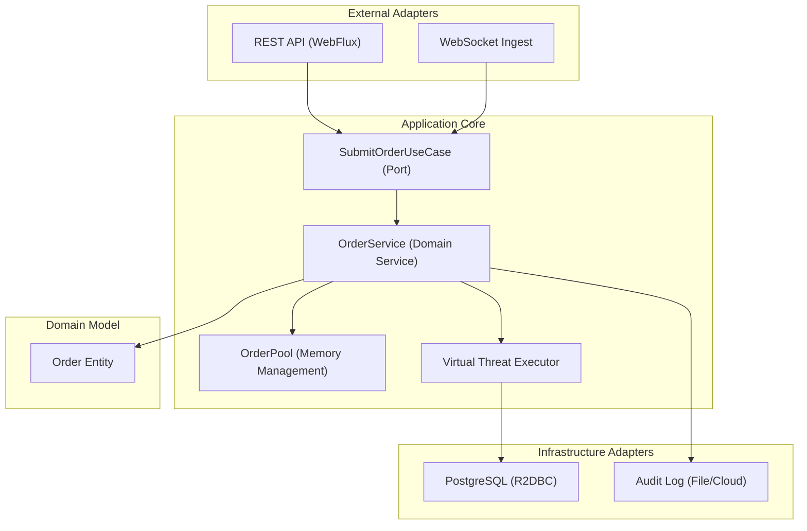

# 🏛️ Institutional OMS Architecture

## 1. High-Level Design
The `trade-oms-java-core` follows a **Clean Hexagonal Architecture**, optimized for the **Java 21 Virtual Threads** and **Project Reactor** ecosystems.

## 2. Low-Latency Memory Strategy
To maintain sub-millisecond execution times under heavy load, the system utilizes a **Zero-Allocation** strategy for hot-path objects.

- **Object Pooling**: Instead of relying on the JVM Garbage Collector for every order, we borrow `Order` instances from a pre-allocated `OrderPool`.
- **Reactive Lifecycle**: Objects are automatically returned to the pool using `.doFinally()` hooks in the Reactor stream.

## 3. Concurrency Matrix
| Component | Engine | Strategy |
| :--- | :--- | :--- |
| API Ingest | WebFlux | Event Loop (Non-blocking) |
| Order Validation | Project Reactor | Functional / Stateless |
| Execution Logic | Virtual Threads | Thread-per-request (Lightweight) |
| Database I/O | R2DBC | Asynchronous |

---
*Engineering standard: Castle Trade LLC Institutional Framework.*
